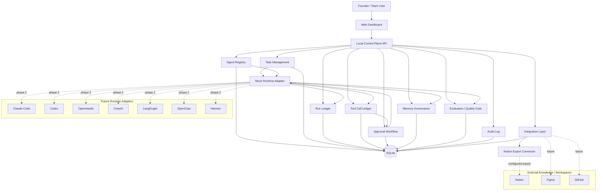
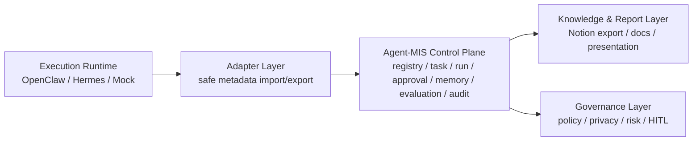
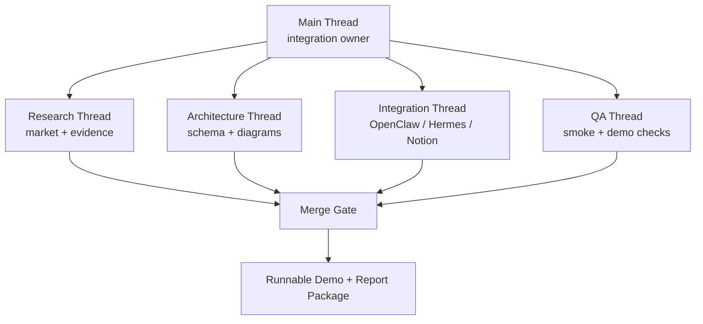
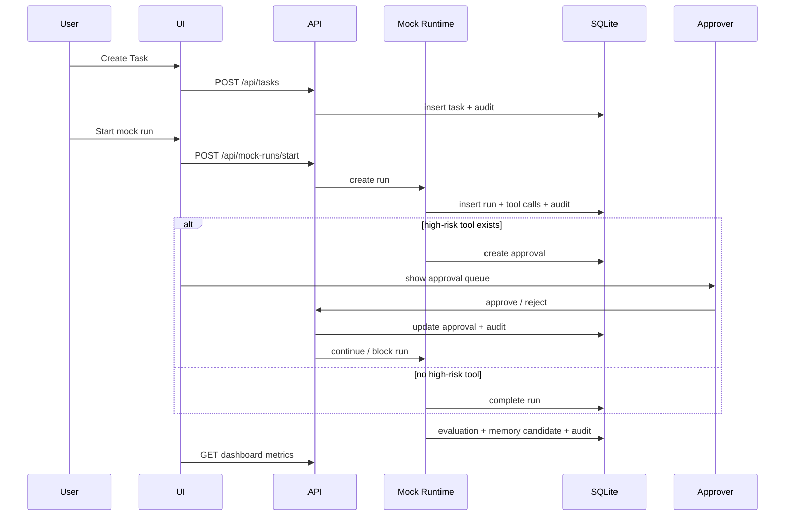
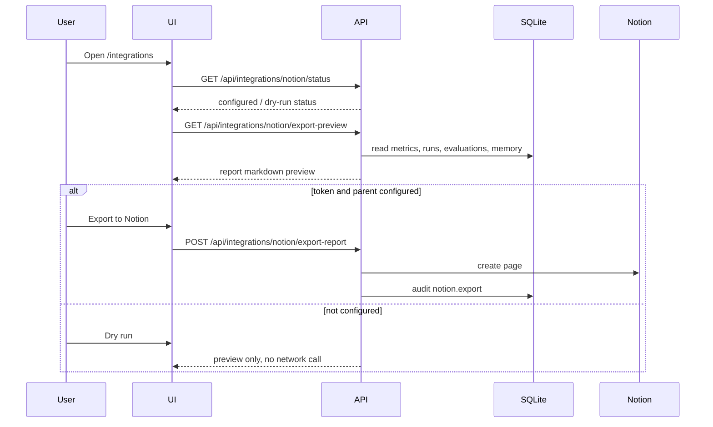

# 系统架构

```mermaid
flowchart TB
  U[Founder / Team User] --> UI[Web Dashboard]
  UI --> API[Local Control Plane API]

  API --> AR[Agent Registry]
  API --> TM[Task Management]
  API --> RL[Run Ledger]
  API --> TL[Tool Call Ledger]
  API --> AP[Approval Workflow]
  API --> MM[Memory Governance]
  API --> EV[Evaluation / Quality Gate]
  API --> AU[Audit Log]
  API --> IN[Integration Layer]

  TM --> RT[Mock Runtime Adapter]
  RT --> RL
  RT --> TL
  TL --> AP
  AP --> RT
  RT --> EV
  RT --> MM
  AR --> RT

  AR --> DB[(SQLite)]
  TM --> DB
  RL --> DB
  TL --> DB
  AP --> DB
  MM --> DB
  EV --> DB
  AU --> DB
  IN --> DB

  IN --> NT[Notion Export Connector]

  subgraph Future Runtime Adapters
    CC[Claude Code]
    CD[Codex]
    OH[OpenHands]
    CR[CrewAI]
    LG[LangGraph]
    OC[OpenClaw]
    HM[Hermes]
  end

  RT -.phase 2.-> CC
  RT -.phase 2.-> CD
  RT -.phase 2.-> OH
  RT -.phase 2.-> CR
  RT -.phase 2.-> LG
  RT -.phase 2.-> OC
  RT -.phase 2.-> HM

  subgraph External Knowledge / Workspaces
    NO[Notion]
    FG[Figma]
    GH[GitHub]
  end

  NT -.configured export.-> NO
  IN -.future.-> FG
  IN -.future.-> GH
```

## 控制面分层

```mermaid
flowchart LR
  A[Execution Runtime<br/>OpenClaw / Hermes / Mock] --> B[Adapter Layer<br/>safe metadata import/export]
  B --> C[Agent-MIS Control Plane<br/>registry / task / run / approval / memory / evaluation / audit]
  C --> D[Knowledge & Report Layer<br/>Notion export / docs / presentation]
  C --> E[Governance Layer<br/>policy / privacy / risk / HITL]
```

## 并行交付架构

```mermaid
flowchart TB
  M[Main Thread<br/>integration owner] --> R[Research Thread<br/>market + evidence]
  M --> A[Architecture Thread<br/>schema + diagrams]
  M --> I[Integration Thread<br/>OpenClaw / Hermes / Notion]
  M --> Q[QA Thread<br/>smoke + demo checks]

  R --> MR[Merge Gate]
  A --> MR
  I --> MR
  Q --> MR
  MR --> D[Runnable Demo + Report Package]
```

## 数据流

```mermaid
sequenceDiagram
  participant User
  participant UI
  participant API
  participant Runtime as Mock Runtime
  participant DB as SQLite
  participant Approver

  User->>UI: Create Task
  UI->>API: POST /api/tasks
  API->>DB: insert task + audit
  User->>UI: Start mock run
  UI->>API: POST /api/mock-runs/start
  API->>Runtime: create run
  Runtime->>DB: insert run + tool calls + audit
  alt high-risk tool exists
    Runtime->>DB: create approval
    UI->>Approver: show approval queue
    Approver->>API: approve / reject
    API->>DB: update approval + audit
    API->>Runtime: continue / block run
  else no high-risk tool
    Runtime->>DB: complete run
  end
  Runtime->>DB: evaluation + memory candidate + audit
  UI->>API: GET dashboard metrics
```

## Notion 导出流

```mermaid
sequenceDiagram
  participant User
  participant UI
  participant API
  participant DB as SQLite
  participant Notion

  User->>UI: Open /integrations
  UI->>API: GET /api/integrations/notion/status
  API-->>UI: configured / dry-run status
  UI->>API: GET /api/integrations/notion/export-preview
  API->>DB: read metrics, runs, evaluations, memory
  API-->>UI: report markdown preview
  alt token and parent configured
    User->>UI: Export to Notion
    UI->>API: POST /api/integrations/notion/export-report
    API->>Notion: create page
    API->>DB: audit notion.export
  else not configured
    User->>UI: Dry run
    API-->>UI: preview only, no network call
  end
```
