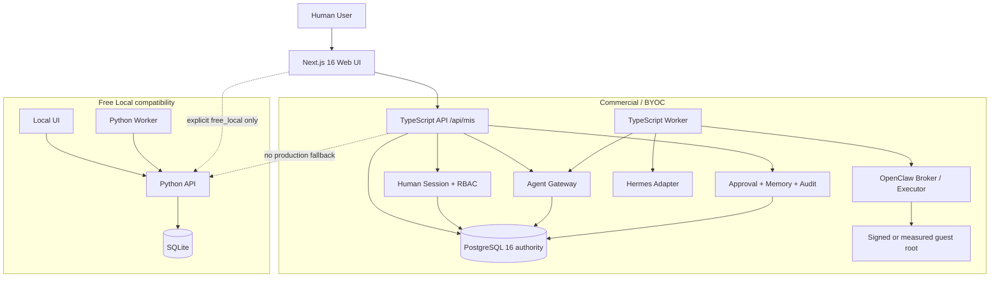
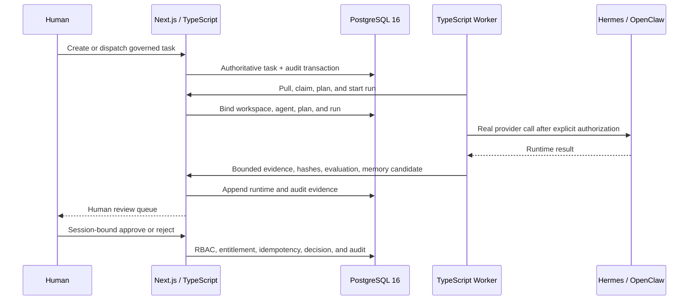
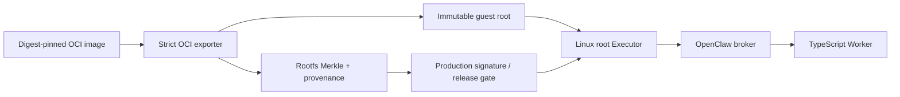
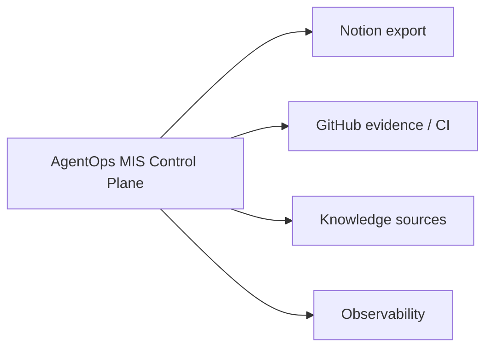

# 系统架构

AgentOps MIS 当前采用双轨产品架构，不再把 Python/SQLite 视为商业版目标栈：

- **Free Local**：Python + SQLite，面向单机、离线开发、兼容回滚和确定性测试。
- **Commercial / BYOC**：Next.js 16 + TypeScript + PostgreSQL 16，面向 Team、Enterprise 和客户自托管部署。
- **真实执行层**：商业 TypeScript Worker 通过 Agent Gateway 调用 Hermes 或 OpenClaw；MIS 只持久化受治理的摘要、哈希和证据，不保存原始 prompt、response 或 transcript。
- **生产边界**：`production`、`shared`、`hosted` 模式必须使用 TypeScript/PostgreSQL owner。未知或尚未迁移的路由 fail closed，不能回落到 Python/SQLite。

迁移尚未完成，当前进度和退出门槛以
[`COMMERCIAL_MIGRATION_CLEAN_ROOM_BREAKDOWN.md`](./COMMERCIAL_MIGRATION_CLEAN_ROOM_BREAKDOWN.md)
为准。

## 产品拓扑

## 权威边界

| 运行模式 | Web/API owner | Worker | 权威数据源 | Python 代理 |
| --- | --- | --- | --- | --- |
| Free Local | 本地 UI + Python API，或显式兼容模式的 Next.js | Python Worker | SQLite | 仅 loopback allowlist |
| Commercial / BYOC | Next.js 16 App Router + TypeScript | TypeScript Worker | PostgreSQL 16 | 禁止，未迁移路由 fail closed |

商业控制面直接持有 Agent identity、task/run lifecycle、Human Session、RBAC、entitlement、approval、prepared action、Memory review、audit 和 evidence。商业 Worker 不直连数据库，只调用受版本约束的 Agent Gateway HTTP contract。

## 商业执行流

原始 provider 输入输出不进入 committed project state。产品就绪声明必须来自同一 source SHA 上的真实 Hermes 和 OpenClaw 闭环，mock 只用于 CI/offline fallback。

## OpenClaw 隔离与供应链

本地 loopback registry 只可用于 Linux CI contract，生成的 provenance 不能通过生产签名和发布读取器。生产发布要求非 loopback 的可信 OCI transport、内容寻址 guest root、可重测 provenance 和签名 release；任何尚未闭合的声明保持 `false`。

## 外部系统

外部系统不是 MIS 权威账本。导入和导出必须经过 workspace scope、provenance、最小数据和审计边界。
